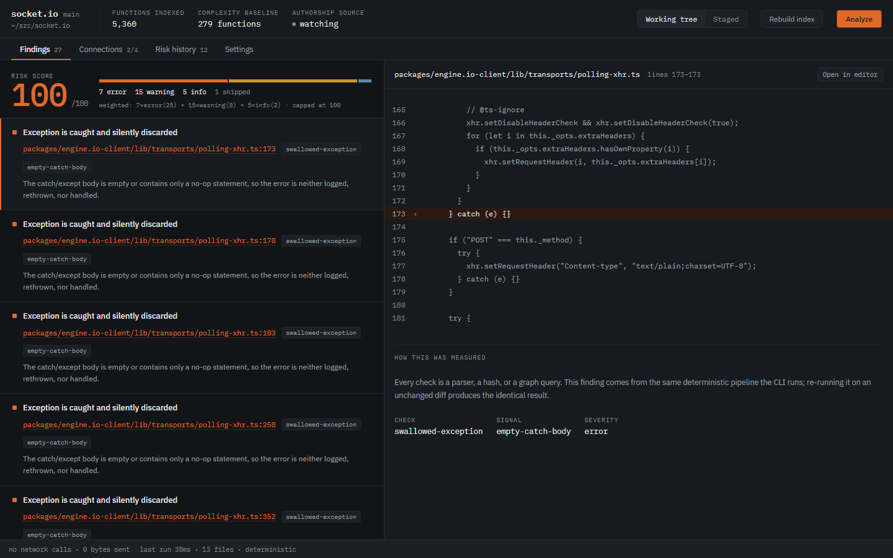
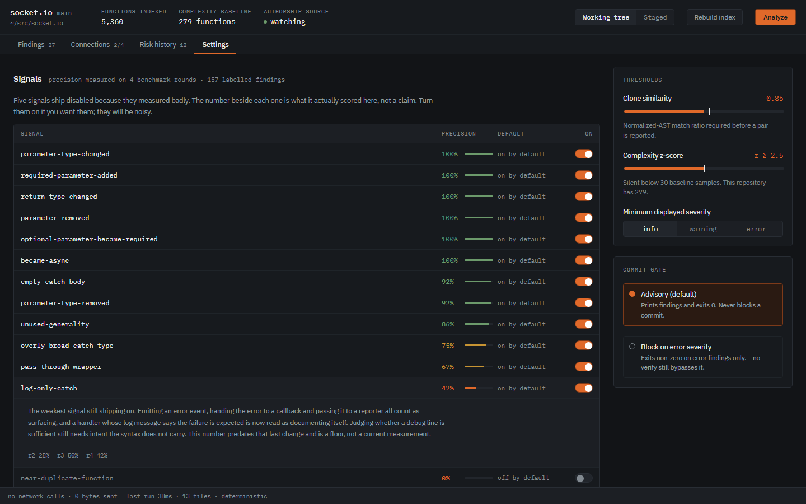
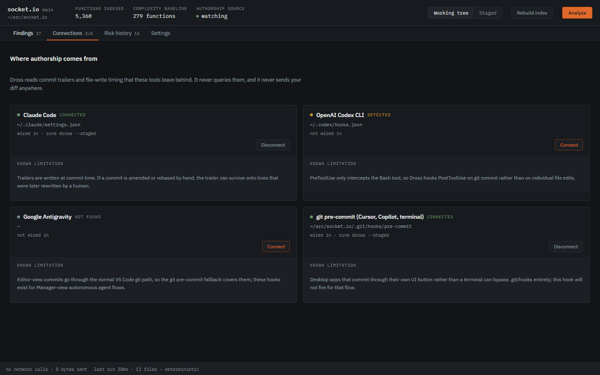
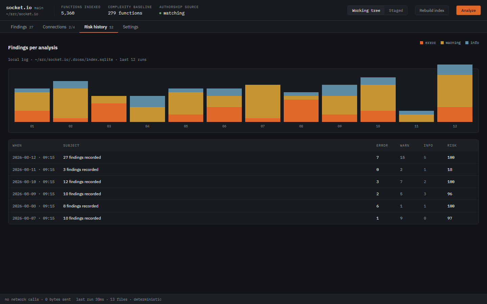

# Dross

**Dross** is the metallurgical term for the impurities skimmed off molten metal before it's cast. This tool does the same to a diff before you commit it.

It catches what agent-generated diffs specifically get wrong — duplicated logic, self-validating tests, silently changed contracts, needless over-engineering, and swallowed exceptions — across whichever AI coding tool you use.

**Every check is a parser, a hash, or a graph algorithm. There are no model calls anywhere in the pipeline.** That is deliberate: it is what makes runs deterministic, reproducible, offline, and free.

> **Status: 1.0.** What that claims and what it does not:
>
> **It claims** the CLI flags, the JSON report shape, the config file and the
> adapter contracts are stable and will not break without a major version; that
> the engine, CLI, adapters, desktop app and benchmark harness are implemented
> and tested; and that precision has been measured across 22 open-source
> repositories and published with its limits, not asserted.
>
> **It does not claim** field-tested. The corpus was chosen by the author, and
> no one has yet run this against a repository the author did not pick. Three
> signals are corroborated by independent tools, and the four disabled signals
> have now been labelled by an independent reviewer — who put all four near zero
> precision, which is why they stay off. The twelve enabled signals' precision
> is still a single-labeller number with the conflict of interest stated. See
> [Benchmarks](#benchmarks) before trusting any figure here.



<sub>A real run: socket.io at `0ae76360f`, 27 findings. Every screenshot here is
the app rendering actual engine output, not a mockup.</sub>

---

## Why this exists

AI-assisted coding moved the bottleneck from writing code to verifying it. The failure modes are specific and mechanical, which means they can be caught structurally rather than by asking another model for an opinion.

Existing tooling in this space is enterprise SaaS: cloud-hosted, subscription-priced, built for team governance. Dross is local-first, deterministic, and free.

## The six checks

| Check | What it catches |
|---|---|
| **Authorship tagging** | Scopes the other checks by whether a hunk was agent-written. Architectural, not a bolt-on. |
| **Swallowed exception** | Empty catch bodies, log-only handlers, overly broad catch types, and failure paths that return a default value shaped like success. |
| **Structural clone** | A function that reinvents logic already in the repository, detected on normalized AST shape so renamed identifiers still match. |
| **Tautological test** | A test whose expected value is derived by re-invoking the logic under test, so it passes regardless of correctness. |
| **Contract change** | Signature changes — new required parameters, narrowed optionality, widened return types, sync becoming async — whose breakage is invisible in the diff itself. |
| **Over-engineering** | Single-implementation abstractions, pass-through wrappers, excess indirection, one-variant factories, unused generality, and changes that are statistical complexity outliers against the repository's own history. |

Each check reports per-signal, so you can tune or disable one signal without losing the rest.

### Languages

JavaScript, TypeScript, TSX, Python and Rust.

Rust has no `try`/`catch`, so the swallowed-exception check reads the `Err` arm
of a `match` instead — the place a `Result` is either dealt with or quietly
dropped. `Err(_) => {}` is reported; `Err(e) => Err(e)`, a `panic!`, or `?` are
not, because the failure still reaches the caller. Rust also keeps its tests
inside the files they test, under `#[cfg(test)]`, and the checks skip those the
way they skip a `tests/` directory elsewhere.

Two things deliberately have no Rust equivalent. `overly-broad-catch-type` has
nothing to say when the error type comes from the signature rather than the
handler, and `if let Ok(v) = ..` without an else is idiomatic enough that
reporting it would reproduce the false positives four rounds of benchmarking
removed.

### The self-calibrating baseline

The over-engineering check does not use a hardcoded "functions over N branches are bad" rule, which breaks across codebases with different norms. It builds a distribution from the repository's own commit history, so "unusually complex" means unusual *for this codebase*. Below 30 history samples the signal stays silent rather than reporting noise.

## Install

Requires Rust 1.88+ (the workspace uses `let` chains).

```bash
git clone https://github.com/Sarthak-47/Dross.git
```

```bash
cargo build --release
```

The CLI lands at `target/release/dross`.

Prebuilt binaries and desktop installers are on the
[releases page](https://github.com/Sarthak-47/Dross/releases).

### Verifying a download

The binaries are **not code-signed** — there is no Apple Developer ID and no
Windows EV certificate behind this project — so macOS Gatekeeper and Windows
SmartScreen will warn on first run. That warning is accurate and you should not
ignore it on the strength of a README.

What is available instead is build provenance: every release asset carries a
signed attestation naming the workflow and commit that produced it.

```bash
gh attestation verify dross-x86_64-unknown-linux-gnu --repo Sarthak-47/Dross
```

Each release also ships `SHA256SUMS.txt`, itself covered by the attestation.

```bash
sha256sum -c SHA256SUMS.txt --ignore-missing
```

Provenance is not a signature: it proves the file came from this repository's
CI at a commit you can read, not that anyone has vouched for the contents.
Building from source, above, needs no trust in either.

## Use

Build the index once per repository. This also replays history to construct the complexity baseline.

```bash
dross index
```

Check what you're about to commit:

```bash
dross check --staged
```

Wire it into your tools:

```bash
dross connections
```

```bash
dross connections install git
```

Other commands: `dross check --worktree` for live edits, `dross history` for the risk trend, `dross init` to write a config file, and `--format json` or `--format compact` on any check for machine-readable output.

## Performance

A pre-commit check has to feel instant or it gets uninstalled, so this is
measured rather than assumed. On a generated 3000-file TypeScript repository,
checking one changed file takes **3ms** of analysis, and **~90ms** end to end
from the shell — the difference is process start, opening the index and asking
git for the diff. The second number is the one a hook actually costs you.

Both are from this machine; treat them as an order of magnitude rather than a
specification.

The index caches per-file symbols and fingerprints. Before that cache existed
the same check took 2.9 seconds, because the repo-wide symbol table was rebuilt
by re-parsing every file on every run. Build the index once with `dross index`;
checks read from it afterwards.

`dross index` walks the tree once, honouring both the configured `ignore_dirs`
and the repository's own `.gitignore`. Ignored files are never indexed: they
cannot appear in a diff, so a finding could not point at one anyway.

Without an index the checks still run, falling back to a full walk — correct,
but slow on a large tree, and clone detection is reported as skipped.

## Integrations

| Tool | Mechanism | Caveats |
|---|---|---|
| **Claude Code** | Native hooks — `PostToolUse` on edits, `PreToolUse` gate on `git commit` | Primary integration; most mature hook surface |
| **OpenAI Codex CLI** | `hooks.json`, `PostToolUse` on `git commit` | Hooks are opt-in and disabled by default. `PreToolUse` only intercepts the Bash tool, so edit-level interception is unavailable |
| **Google Antigravity** | JSON hooks | Covers Manager-view autonomous flows; Editor-view commits go through the git fallback |
| **Everything else** | git `pre-commit` hook | Covers Cursor, Copilot, and terminal use |

**One honest limitation:** desktop apps that commit through their own UI button rather than a terminal can bypass `.git/hooks` entirely. The fallback works from a terminal but will not fire for that specific flow. Each adapter reports its own caveats in the Connections panel rather than burying them here.

Every adapter merges into existing configuration rather than overwriting it, tags what it added, and removes only that on uninstall.

## Desktop app

The Tauri app is the primary surface. Findings sit in a split pane with the
exact source lines each one refers to and a plain-language note on how it was
measured. The Connections panel prints each integration's own limitations on
its card rather than hiding them in docs. Settings shows every signal's
**measured precision beside its toggle**, along with the reason each disabled
one was switched off — the numbers are the ones from the benchmark, not
marketing.

Checks that could not run appear inline with their reason, heuristic authorship
is labelled heuristic, and the status bar states `no network calls · 0 bytes
sent`. The fonts are self-hosted so that claim stays true.



Settings is where the measurement lives. Each signal shows what it scored on the
benchmark corpus, which rounds produced that number, and — for the five that
ship disabled — why. Expanding a row gives the reasoning in full.



Every integration prints its own caveats on its card. The git hook's card says
that a desktop app committing through its own UI button bypasses `.git/hooks`
entirely, because that is true and burying it in documentation would not make it
less true.



The trend comes from `.dross/index.sqlite` in the repository being analysed.
Nothing is uploaded; there is nowhere for it to go.

The screenshots above are produced by `apps/desktop/uiharness.html`, a
development page that stubs the Tauri IPC bridge so the real UI renders a real
analysis in a browser. It is not part of any build — Vite's only entry is
`index.html` — and the findings it renders are genuine engine output rather
than fixtures. It exists because every visual check before it was of an empty
state, and the first run of it found six bugs.

```bash
npm install --prefix apps/desktop
```

```bash
npm run app:dev --prefix apps/desktop
```

To produce an installer for the current platform:

```bash
npm run app:build --prefix apps/desktop
```

## Benchmarks

Measured, not asserted, and published as they came out.

**22 open-source JS/TS and Python repositories, 157 labeled findings:**

| | |
|---|---|
| Precision, default configuration | **87.2%** |
| Precision, every signal enabled | 73.9% (95% CI 66–80%) |
| Starting point, before the benchmark exposed what was wrong | 32.4% |

Per check, with everything enabled: contract-change 98.7%, over-engineering
73.7%, swallowed-exception 52.1%, structural-clone 0%.

Four signals ship **disabled**, and an independent reviewer has now labelled
their output: near-duplicate-function 2.6%, the other three 0% precision on the
sampled corpus. The clone case is the pattern — in a mature codebase,
structurally identical functions are almost always deliberate parallel
structure, and the check cannot tell that from reinvention. They stay
implemented and switch on per repository; the numbers are honest floors to
improve against, not a reason to trust them yet. A fifth,
`overkill-design-pattern`, was **deleted** rather than disabled: zero true
positives across 24 labelled findings and three fix attempts that left the
volume higher than they found it. The reasoning, the independent labels, and
the numbers behind each are in
[docs/BENCHMARK_RESULTS.md](docs/BENCHMARK_RESULTS.md).

**Recall** is measured against the seeded corpus in `fixtures/seeded`, not this
run: a label pass over emitted findings contains no false negatives by
construction. Every seeded positive is caught and no seeded negative flagged,
verified in CI with all signals enabled.

**Three of the signals are corroborated independently.** Where a signal has a
close equivalent in a mature tool, the judgement is taken out of it entirely:
every one of 149 findings that ruff or oxlint has a rule for, they also flagged.

| Dross signal | Independent rule | Agreement |
|---|---|---:|
| empty-catch-body (JS/TS) | oxlint `no-empty` | 113/113 |
| empty-catch-body (Python) | ruff `S110` | 6/6 |
| overly-broad-catch-type | ruff `BLE001` / `E722` | 30/30 |

Clone findings are checked the same way against **jscpd**, an independent
copy-paste detector, but the result there is a floor rather than a rate: jscpd
compares tokens and Dross compares normalized ASTs, so a renamed clone — the
case Dross exists to catch — is the exact case jscpd is built not to see.
Agreement therefore means "duplicate by any definition"; silence means nothing
either way. `docs/BENCHMARK_RESULTS.md` gives the split.

The **complexity metric** is checked the same way, against ruff's `C901` — the
reference `mccabe` implementation — function by function across every Python
repository in the corpus. That comparison found two real faults: `else` counted
as a decision of its own, and Python's `match` not counted at all. Across 34,431
functions agreement went from 74% to **98%**, and no function is scored higher
than the reference — the remainder is one documented difference over nested
functions.

Agreement is not truth, and it does not cover the other ten signals — but it is
evidence that does not come from the labeller.

**Two limits worth knowing before you trust the rest.** The labeling was a
single pass by the same family of system this tool is built to check — a real
conflict of interest, which is why the harness computes Cohen's kappa against a
second label set. And only 81 findings came from commits carrying an agent
trailer, so this measures Dross on ordinary repositories rather than on the
agent-generated diffs it targets.

Reproduce it:

```bash
cargo run -p dross-bench -- run --repo-dir .bench/repos --all-signals --out findings.jsonl
```

```bash
python .bench/crossvalidate.py findings.jsonl && python .bench/clonevalidate.py findings.jsonl
```

```bash
cargo run -p dross-bench -- report --labels docs/benchmark-labels-final.jsonl
```

## Known limitations

Stated plainly, because a tool that hides these gets uninstalled at the first surprise:

- **Symbol resolution is name-based, not semantic.** tree-sitter is a syntax parser with no binder or type checker, so two functions sharing a name collapse into one entry and re-export chains are not followed. Checks that depend on repo-wide resolution consult an ambiguity set and decline to fire on ambiguous names — the limitation costs recall, never precision. A real resolver means shelling out to `tsc`/`pyright`, which would break the offline guarantee.
- **Authorship tagging is heuristic.** Commit trailers are reliable when present; burst-write timing is not. A hunk mistagged as human silently drops to a lighter check pass, so confidence is surfaced in the UI and can be corrected rather than hidden.
- **Language support is JS/TS/TSX, Python and Rust.** Everything else is
  unreadable to the tool. It says so rather than passing silently: a run that
  changed Go files reports `note: 2 changed file(s) not read — no grammar for
  .go`, and `files_analyzed` counts only what was actually parsed. The note
  names source languages only, never documentation or lockfiles, because a note
  that fires on every commit is one the reader stops seeing.
- **The complexity-outlier signal needs history.** Under 30 baseline samples it reports nothing.

## Architecture

```
crates/
  dross-core       engine: diff, AST, checks, fingerprint index, scoring
  dross-cli        CLI (binary: dross)
  dross-adapters   Claude Code, Codex, Antigravity, git hook
  dross-bench      benchmark harness
apps/desktop       Tauri 2 + React + TypeScript
fixtures/seeded    ground-truth corpus
```

The CLI, the desktop app, and the benchmark harness all call the same `dross-core` engine, so they cannot drift apart.

## Development

```bash
cargo test --workspace
```

```bash
cargo clippy --workspace --all-targets -- -D warnings
```

Run everything CI runs before pushing, rather than after:

```bash
git config core.hooksPath .githooks
```

That enables a `pre-push` hook covering formatting, clippy, the Rust tests and
the desktop tests. It is opt-in per clone and not installed automatically —
a hook that appears without being asked for is the behaviour the adapter code
refuses to have, and the same rule applies here. `git push --no-verify` skips
it deliberately.

CI runs on Linux, macOS, and Windows, and includes a determinism gate: the same diff analyzed twice must produce byte-identical output. Reproducibility is the core claim, so it is enforced rather than asserted.

## License

Apache-2.0. See [LICENSE](LICENSE).
